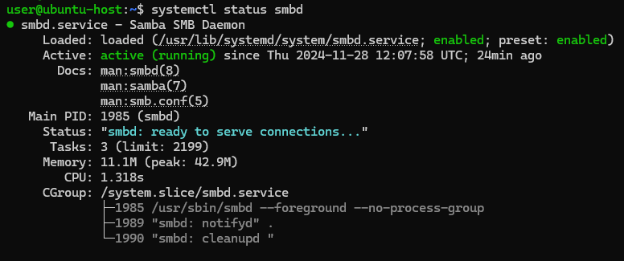
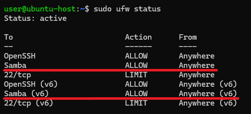
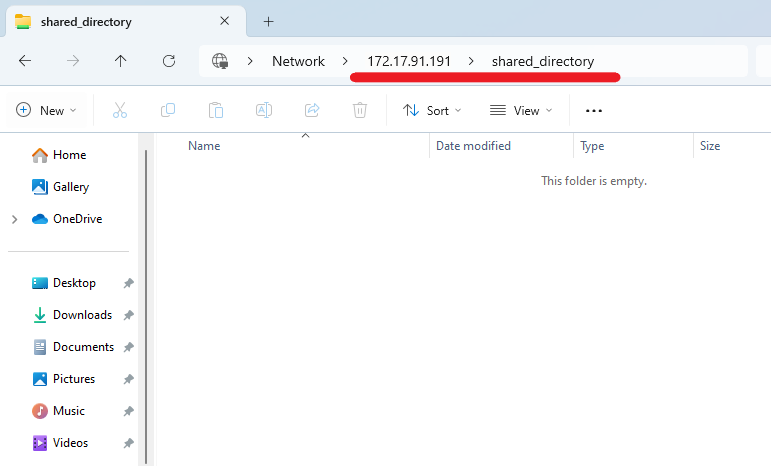
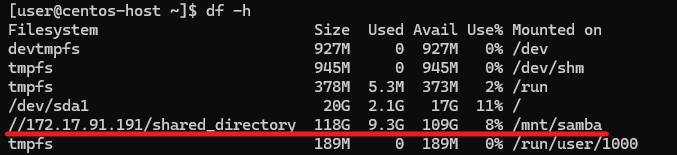

# Configuring CentOS Stream 9 to Connect to Samba Resources on Ubuntu 24.04

This guide focuses on connecting a [CentOS Stream 9](https://www.centos.org/centos-stream/) server to a file resource shared via Samba on an [Ubuntu 24.04](https://ubuntu.com/server) server. Whether you’re managing a multi-OS infrastructure or simply need to link these systems for a specific task, this step-by-step tutorial will help you set up and access shared folders effortlessly.

## Configuring Samba on Ubuntu 24.04

First, update the package lists for the system’s package manager:
```
sudo apt update
```
Install Samba using the `apt` package manager:
```
sudo apt install samba
```
Check the Samba status to ensure it’s installed correctly:
```
systemctl status smbd
```


## Configuring the Firewall

If your firewall is enabled, allow Samba traffic:
```
sudo ufw allow Samba
```
Check the UFW status:
```
sudo ufw status
```
The output list must contain a line corresponding to the permission rules for Samba.



## Configuring Samba

Create the directory for the share:
```
sudo mkdir -p /var/shared_directory
```
Set appropriate permissions:
```
sudo chmod 777 /var/shared_directory
```
The main configuration file is located at `/etc/samba/smb.conf`. Open it with a text editor:
```
sudo nano /etc/samba/smb.conf
```
At the bottom of the file, define a new shared folder. For example:
```
[shared_directory]
path = /var/shared_directory
browseable = yes
public = no
read only = no
guest ok = no
create mask = 0700
directory mask = 0700
```
Here’s a breakdown of each line in the Samba configuration:

`[shared_directory]` is the name of the share that the users should use for accessing the share, for example, `\\X.X.X.X\shared_directory`, where `X.X.X.X` is your Ubuntu server IP address.

`path = /var/shared_directory` specifies the actual directory on the server’s file system that will be shared.

`browseable = yes` allows the share to be visible in network browsing tools (e.g., Windows Network or file explorers). If set to `no`, users must know the exact share name to access it.

`public = no` controls whether the share is accessible to unauthenticated users. The value `no` requires a valid username and password for access.

`read only = no` controls whether users can only read files or can also write (edit, delete, or add new files). If the value is `no`, users can read and write.

`guest ok = no` controls whether guest users can access the share. If the value is `no`, only authenticated users with valid Samba credentials can access.

`create mask = 0700` sets default permissions for new files created in the share.

`directory mask = 0700` sets default permissions for new directories created in the share.

Then restart Samba service:
```
sudo systemctl restart smbd
```
Next, add the user for accessing the shared directory. In our example, such a user would be `centos-user`:
```
sudo useradd centos-user
```
Set a password in Samba for the created user:
```
sudo smbpasswd -a centos-user
```
Check access to the shared directory. For example, in Windows, open File Explorer and enter the path to the shared directory, where replace `X.X.X.X` with your Ubuntu server IP address and `shared_directory` with the name of the share.
```
\\X.X.X.X\shared_directory
```
If you have provided valid Samba credentials, you will get access to the shared directory.



## Connecting CentOS Stream 9 to Samba

When you finish configuring Samba on Ubuntu, go to the process of connecting CentOS Stream 9 to the shared directory.

As usual, update the package lists for the system’s package manager before installing new software:
```
sudo dnf update
```
Next, install the CIFS (Common Internet File System) utilities package:
```
sudo dnf install cifs-utils
```
Create an empty directory where the external file system will be mounted. This directory becomes the access point for the files and directories on the mounted resource. In our example, such a directory is `/mnt/samba`:
```
sudo mkdir -p /mnt/samba
```
Mount the Samba share to the created directory:
```
sudo mount -t cifs -o username=centos-user,password=centos-user-password //X.X.X.X/shared_directory /mnt/samba
```
In this case:

`centos-user` is the name of the user created in Samba.

`centos-user-password` is the password of the user created in Samba.

`X.X.X.X` is the Ubuntu server IP address.

`shared_directory` is the name of the shared directory.

`/mnt/samba` is the mount point for the share.

## Automatically mount the share on boot (optional)

If you need to automatically mount the share on boot, open `/etc/fstab` for editing:
```
sudo vi /etc/fstab
```
Add the following line:
```
//X.X.X.X/shared_directory /mnt/samba cifs username=centos-user,password=centos-user-password,iocharset=utf8 0 0
```
In this line:

`X.X.X.X` is your Ubuntu server IP address.

`shared_directory` is the name of the shared directory.

`/mnt/samba` is the mount point for the share.

`cifs` stands for Common Internet File System, a protocol used by Samba for sharing files over a network.

`centos-user` is the name of the user created in Samba.

`centos-user-password` is the password of the user created in Samba.

`iocharset=utf8` specifies the character encoding for file names.

`0 0`: the first `0` specifies whether to back up the file system using the `dump` utility; the second `0` specifies the order in which file systems are checked during boot by `fsck`.

Close the file and save the changes you have made, then reboot the system. After the system boots up, use the following command to display information about the disk space usage of file systems. It shows the amount of available and used disk space for each mounted file system on your system.
```
df -h
```
The output list must contain the line containing information about the mount point for the share.


