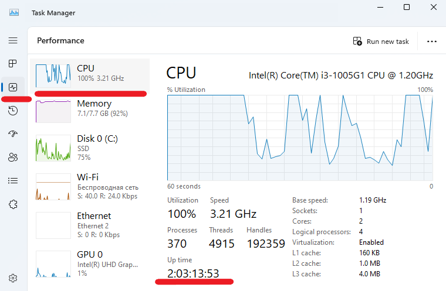
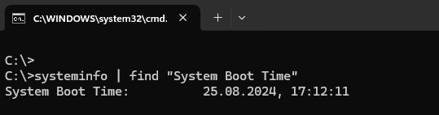
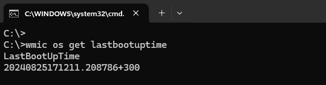
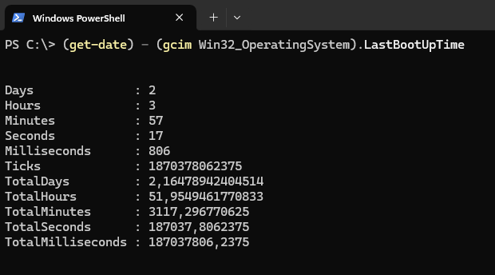

# How to Check System Uptime in Windows

Uptime refers to the amount of time a system, server, or device has been continuously running and available without any downtime or interruptions. It is often expressed as a percentage, indicating the reliability of the system over a specific period. For example, if a server has an uptime of 99.9%, it means that the server was operational and available 99.9% of the time during the measured period.

Uptime is a critical metric in IT and server management because it reflects the stability and reliability of a system. High uptime is often a goal for system administrators to ensure that services are consistently available to users or customers.

To check your system uptime in Windows, you can use several methods. Here are a few common ways.

## Using Task Manager

Press `Ctrl` `Shift` `Esc` to open the Task Manager and go to the `Performance` tab. Then select CPU from the left panel, look for the Uptime value near the bottom of the CPU section. This will show the time since the system was last started.



## Using Command Prompt

To open the Command Prompt press `Win R`, type `cmd`, then press `Enter`. When the Command Prompt will open, type the following command and press `Enter`:
```
systeminfo | find "System Boot Time"
```
This command will display the date and time when the system was last booted. The output of the command will look something like this:



To determine uptime you can also use WMIC (Windows Management Instrumentation Command-line). This command-line tool provides access to a wide range of operating system data. To display the time of the last system start, type in the command line:
```
wmic os get lastbootuptime
```


The output of the command consists of components:

`2024` is the year;

`08` is the month;

`25` is the day;

`17` is the hour;

`12` is the minute;

`11` is the second;

`208786` is microseconds;

`300` is the timezone offset.

## Using PowerShell

Open PowerShell by pressing `Win R`, type `powershell` and press `Enter`. Enter the following command:
```
(get-date) - (gcim Win32_OperatingSystem).LastBootUpTime
```
The output will look like this:



These lines contain the following information:

`Days`, `Hours`, `Minutes`, `Seconds`, `Milliseconds`: these properties provide a detailed breakdown of the uptime;
`Ticks`, `TotalDays`, `TotalHours`, `TotalMinutes`, `TotalSeconds`, `TotalMilliseconds`: these properties provide the total uptime expressed in the respective units.

## Conclusion

So we found out how to check system uptime in Windows using tools like Task Manager, Command Prompt, and PowerShell. Applying this methods you can easily determine how long your system has been running without interruption.
