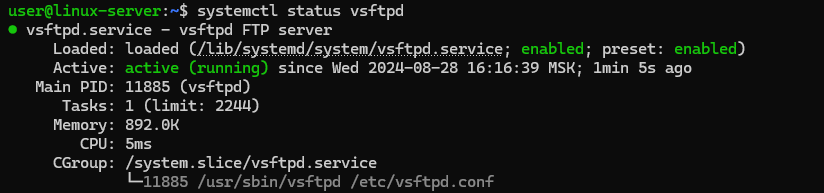
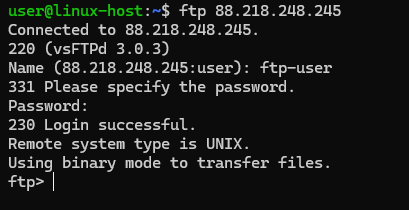
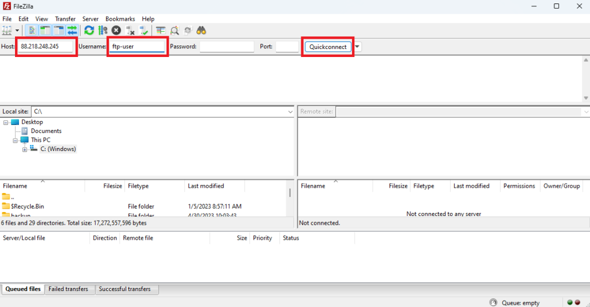
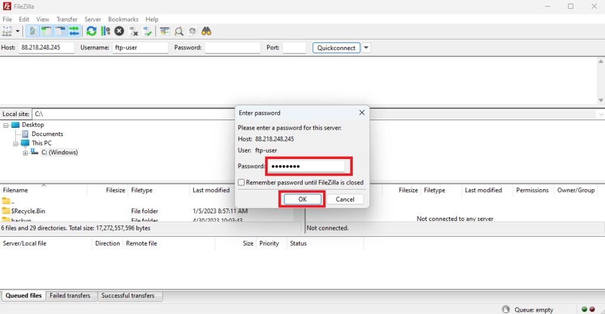
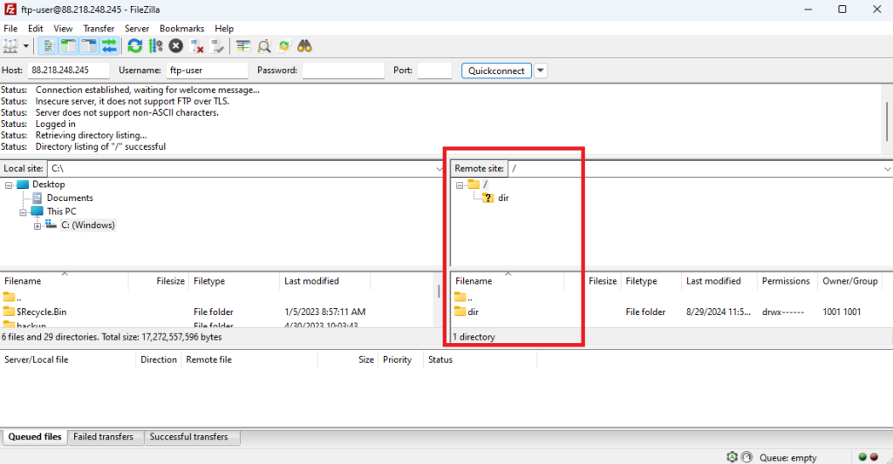

# How to Deploy an FTP Server on Debian 12

An FTP server is a type of server software that facilitates the transfer of files between a client and a server over a network using the File Transfer Protocol (FTP). It acts as a centralized storage location where users can upload, download, and manage files. In the guide, we will look at how to deploy an FTP server on Debian 12.

## How to Install FTP Server

The easiest way to deploy an FTP server on Debian is to install and set up `vsftpd` package, which is a popular and secure FTP server.

Update the package list before you start installing new software:
```
sudo apt update
```
Then install `vsftpd`:
```
sudo apt install vsftpd
```
After the installation is complete start the service:
```
sudo systemctl start vsftpd
```
And enable vsftpd to start on boot:
```
sudo systemctl enable vsftpd
```
To check the current status of the vsftpd service launch the command:
```
systemctl status vsftpd
```



## Creating an FTP Account and a Shared Directory

Now, after installing `vsftpd`, you need to create and configure an account and a directory that the FTP server will use.

The following command will add a new user account named `ftp-user` for example:
```
sudo useradd ftp-user
```
Then create a home directory for `ftp-user` using `mkhomedir_helper` utility:
```
sudo mkhomedir_helper ftp-user
```
And set the password for `ftp-user`:
```
sudo passwd ftp-user
```
For this tutorial we create a new directory:
```
sudo mkdir /ftp-directory
```
And set it as the FTP user home directory instead of the previously created one.
```
sudo usermod -d /ftp-directory ftp-user
```
The next command will change the ownership of the directory `/ftp-directory` so that it is owned by the user `nobody` and the group `nogroup`:
```
sudo chown nobody:nogroup /ftp-directory
```
After executing the following command, the `ftp-user` will become the owner of the `/ftp-directory` and the ftp-user group will be associated with it, granting the `ftp-user` and any other members of the `ftp-user` group the appropriate permissions to manage the directory and its contents.
```
sudo chown ftp-user:ftp-user /ftp-directory
```
## Configuring the FTP Server

To configure the FTP server navigate to `/etc` directory:
```
cd /etc
```
Open the configuration file using text editor `nano`:
```
sudo nano vsftpd.conf
```
Modify the following lines in the configuration file:
```
listen=YES
listen_ipv6=NO
anonymous_enable=NO
local_enable=YES
write_enable=YES
dirmessage_enable=YES
use_localtime=YES
xferlog_enable=YES
connect_from_port_20=YES
xferlog_std_format=YES
chroot_local_user=YES
secure_chroot_dir=/var/run/vsftpd/empty
pam_service_name=vsftpd
allow_writeable_chroot=YES
```
Also set the range of ports, for example `37900`–`38000`, the FTP server will use for establishing passive FTP data connections, which is essential for configuring both server security and network access control. To do this add the following strings to the end of vsftpd.conf file:
```
pasv_min_port=37900
pasv_max_port=38000
```
When editing is complete, close the file and save the changes you have made.To apply the changes restart the `vsftpd` service:
```
sudo systemctl restart vsftpd
```
## Configuring the Firewall

An FTP server uses multiple ports to facilitate communication between the client and the server:

Port `20` is used for data transfer in Active FTP mode.

Port `21` is used for the control connection in both Active and Passive FTP.

A configurable range of ports used for data transfer in Passive FTP mode.

If you use Uncomplicated Firewall (UFW) on your system, you need to add rules that allow access to the FTP server through these ports.

First, add rules that open ports `20` and `21`:
```
sudo ufw allow 20/tcp
sudo ufw allow 21/tcp
```
Secondly, create a rule for the port range that you specified in `vsftpd.conf` earlier:
```
sudo ufw allow 37900:38000/tcp
```
## Checking the Connection

To check the connection to the created FTP server, you can use various methods depending on whether you prefer command-line tools or graphical applications.

For example, in Linux system you can check the connection using the command in the terminal:
```
ftp X.X.X.X
```
In this case, change `X.X.X.X` to your FTP server IP address.



If you work on Windows and prefer to use GUI Tools, you can check the connection using a client such as FileZilla.

Open FileZilla, enter the FTP server IP address and username. Then click `Quickconnect`:



Then enter the FTP user’s password:



Once connected, the directories on the left side of FileZilla represent your local files, and the directories on the right represent the remote files on the FTP server.



## Conclusion

After completing the steps described in this guide, you should deploy an FTP server on Debian 12 using `vsftpd`.
