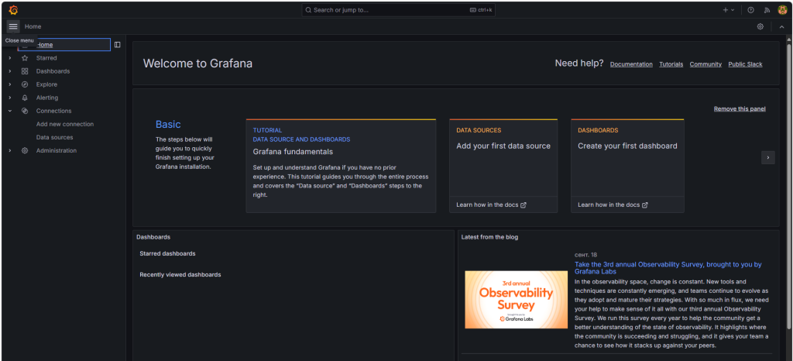

# How to Install Grafana on CentOS
Grafana is an open-source platform used for monitoring, visualizing, and analyzing metrics and logs from various data sources. It is widely used by IT teams, developers, and data analysts to track the performance of systems, applications and infrastructures in real time.
In the guide, we will look at how to install Grafana on CentOS Stream 9.
## How to Install Grafana on CentOS Stream 9
Since the Grafana repository is not included by default in CentOS Stream, you need to manually add the official Grafana repository to your system’s repository list.
To do this navigate to the directory `/etc/yum.repos.d/`:
```
cd /etc/yum.repos.d/
```
Add the official Grafana repository by creating a new repository configuration file in the directory `/etc/yum.repos.d/`:
```
sudo vi grafana.repo
```
Add the following content to the file `grafana.repo`:
```
[grafana]
name=grafana
baseurl=https://packages.grafana.com/oss/rpm
repo_gpgcheck=1
enabled=1
gpgcheck=1
gpgkey=https://packages.grafana.com/gpg.key
```
Save the file and exit.
Update the package list:
```
sudo dnf update
```
Install Grafana:
```
sudo dnf install grafana
```
Start the Grafana service:
```
sudo systemctl start grafana-server
```
Enable Grafana to start on boot:
```
sudo systemctl enable grafana-server
```
To check the status of the service, run the command:
```
sudo systemctl status grafana-server
```
The output of the command should look like this:


## Firewall configuring

If you’re using a firewall, open the necessary port (default is 3000):
```
sudo firewall-cmd --permanent --add-port=3000/tcp
```
Then reload the firewall rules and configuration without restarting the firewall service:
```
sudo firewall-cmd --reload
```
## Access Grafana Web Interface

To access Grafana interface open your web browser and go to `http://10.10.10.10:3000`. In the line, replace 10.10.10.10 with your server IP-address.


Use the default credentials to log in:
username: `admin`;
password: `admin`.

Before you see the Grafana interface, you will be prompted to change the password after logging in.

Now, Grafana should be successfully installed and running on your CentOS Stream 9 system.



## Conclusion

So, we’ve looked at how to install Grafana on CentOS Stream 9.

You can use Grafana to create interactive dashboards that visualize data from various sources like Prometheus, InfluxDB, or MySQL. It allows you to monitor system performance, application metrics, or business KPIs in real time. You can also set up alerts based on custom thresholds and receive notifications through channels like email or Slack.
