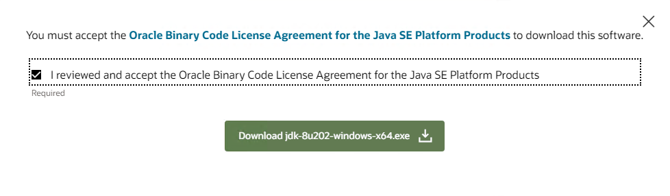
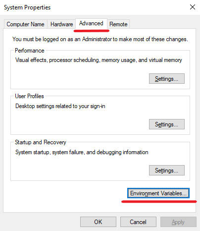

# How to Install JDK 8 on Windows Server

The JDK (Java Development Kit) is a software development kit provided by Oracle and other vendors that is used for developing Java applications. It contains everything a programmer needs to write, compile, and run Java programs.

JDK 8 (also known as Java SE 8) is one of the most significant versions of the Java Development Kit, released by Oracle in March 2014. It introduced several important new features that significantly enhanced the Java language and its ecosystem. JDK 8 became a long-term support (LTS) release and remained one of the most widely adopted versions of Java for several years.

In this article, we will look at how to install and configure JDK 8 on Windows Server 2019.

## How to Install and Configure JDK 8

To install Java 1.8 (JDK 8) visit the [official Oracle Java SE page](https://www.oracle.com/java/technologies/javase/javase8-archive-downloads.html) and download the `.exe` file for 64-bit Windows systems.

Once the download is complete, locate the `.exe` file and double-click it to launch the installer. The installer will guide you through the installation process. By default, the JDK will be installed in `C:\Program Files\Java\jdk1.8.x_xxx` directory.

After installation, you’ll need to set up the necessary environment variables (`JAVA_HOME` and update `PATH`). To do this, right-click on `This PC` and choose `Properties`. Then click `Advanced system settings`. In the `System Properties` window, go to the `Advanced` tab and click the `Environment Variables` button.

Continued on the [iolloi.icu](https://iolloi.icu/index.php/2024/09/23/how-to-install-jdk-8-on-windows-server/)
