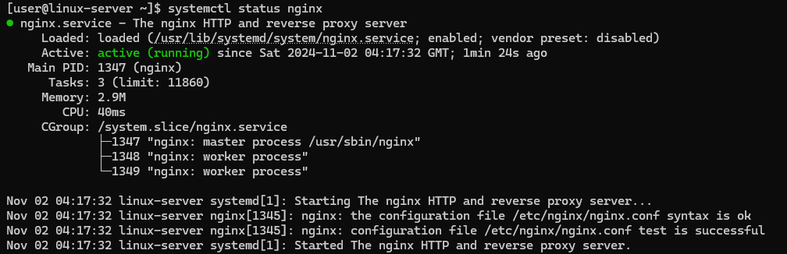
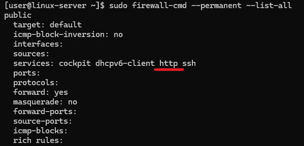
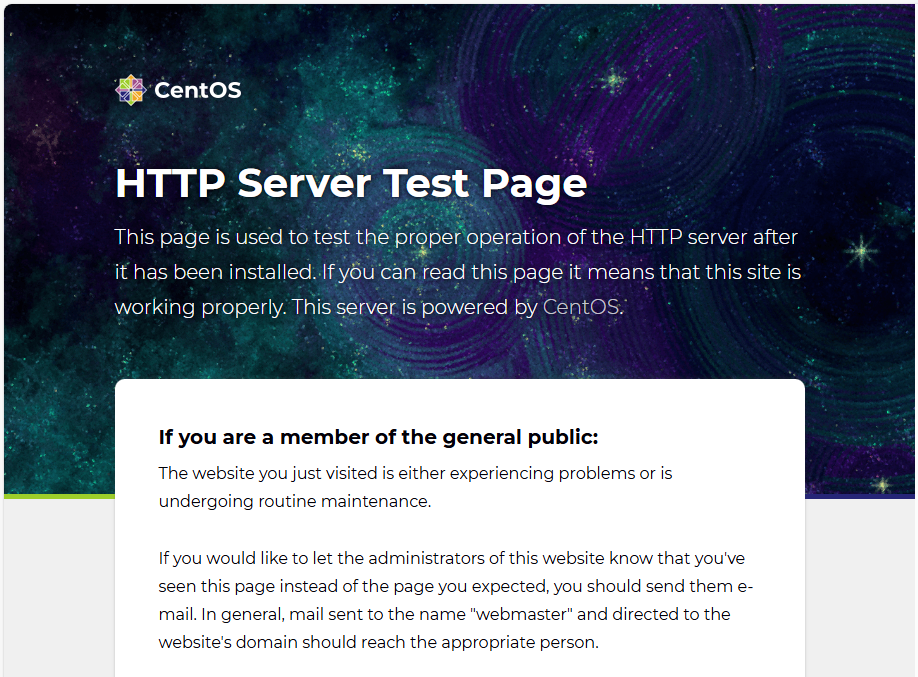
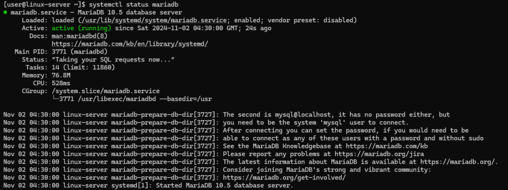
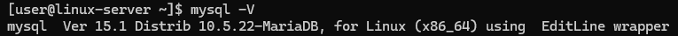
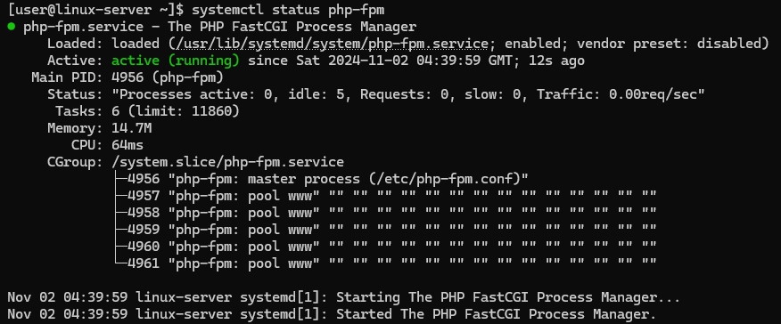
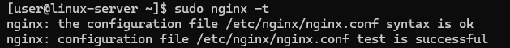
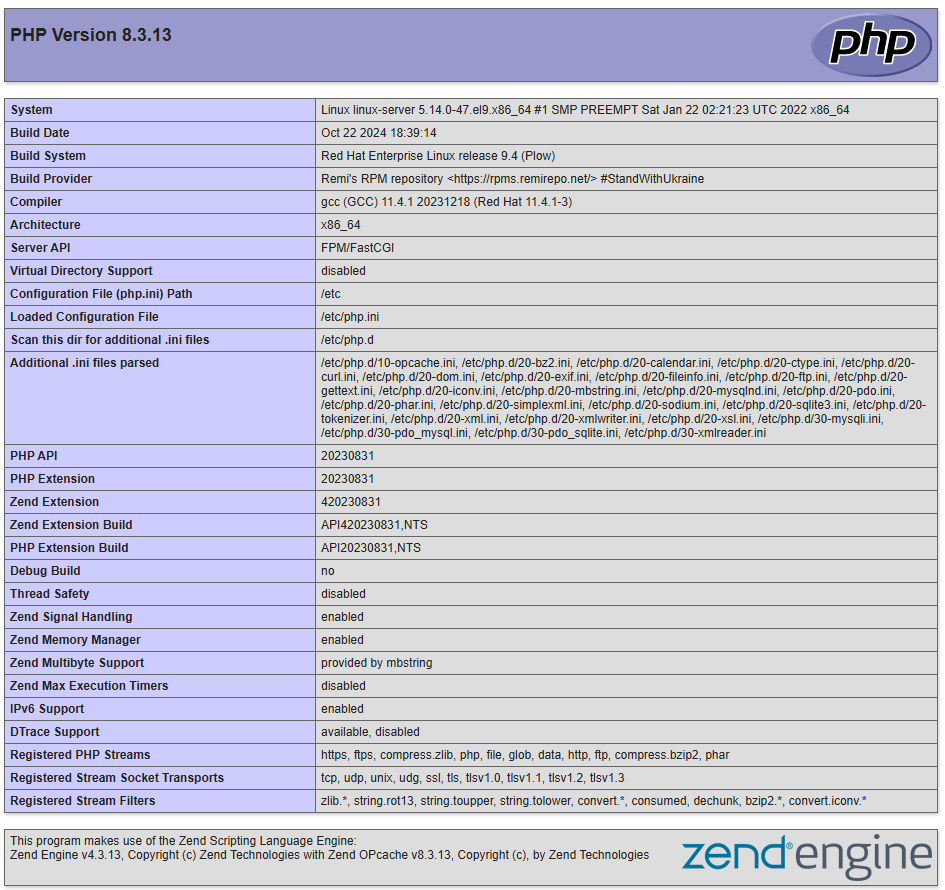
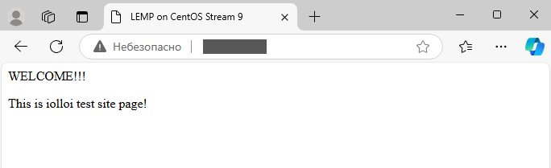

# How to Install LEMP on CentOS Stream 9

LEMP is a software stack used for web development. The acronym LEMP stands for:

Linux – the operating system on which the stack is based.

[Nginx](https://nginx.org/) (pronounced `Engine-X`) – the web server, which serves web pages to users.

[MariaDB](https://mariadb.org/) (or MySQL) – the database management system used to store and retrieve data.

[PHP](https://www.php.net/) (or sometimes Python/Perl) – the programming language used to process dynamic content and generate web pages.

The LEMP stack is popular because it offers a flexible, open-source solution for developing and deploying websites and web applications. Nginx, in particular, is known for its efficiency in handling high traffic loads and its ability to act as both a web server and a reverse proxy.

In this article, we will look at how to install LEMP on CentOS Stream 9.

## How to Install LEMP on CentOS Stream 9

In our example, the LEMP stack will consist of Linux, Nginx, MariaDB, and PHP.

### Install Nginx

Before installing any software, it’s good practice to ensure the system packages are up-to-date:
```
sudo dnf update
```
Install Nginx:
```
sudo dnf install nginx
```
Enable and start Nginx:
```
sudo systemctl enable --now nginx
```
Check the status of the Nginx service:
```
systemctl status nginx
```


Allow HTTP traffic through the firewall:
```
sudo firewall-cmd --permanent --add-service=http
```
To display the rules that are permanently applied, run the command:
```
sudo firewall-cmd --permanent --list-all
```
Make sure that there is `http` entry in the `services` row:



Reload the firewall configuration managed by the `firewalld` service:
```
sudo firewall-cmd --reload
```
Open a browser and go to your server’s IP address or domain name. If it’s working, you’ll see the default Nginx welcome page.



### Install MariaDB

Install MariaDB with the following command:
```
sudo dnf install mariadb-server mariadb
```
Enable and start MariaDB:
```
sudo systemctl enable --now mariadb
```
Check the status of the MariaDB service:
```
systemctl status mariadb
```


Check if the correct version of the MariaDB client is installed or troubleshoot version compatibility issues:
```
mysql -V
```


The next command is a security script provided by MariaDB to help you improve the security of your database server by guiding you through some essential configuration steps. It prompts you through a series of steps designed to harden the security of your MariaDB instance:

✔  set the `root` password;

✔ remove anonymous users;

✔ disable remote `root` login;

✔ remove the test database;

✔ reload privilege tables.

To run the script, type in the command line:
```
sudo mysql_secure_installation
```

### Install PHP

The default CentOS Stream repositories often contain only the more stable, older versions of software packages. This applies to PHP as well. In the manual, we will install the most recent version of PHP or additional modules that are not available in the default repositories. Therefore, we need to enable external repositories such as EPEL and Remi.

First, install EPEL. EPEL itself doesn’t contain PHP, but it’s a prerequisite because some packages and dependencies for newer PHP versions rely on EPEL.
```
sudo dnf install epel-release
```
After enabling EPEL, install the Remi repository:
```
sudo dnf install https://rpms.remirepo.net/enterprise/remi-release-9.rpm
```
Reset the PHP module to avoid conflicts with older versions:
```
sudo dnf module reset php
```
Enable the desired PHP stream (e.g., PHP 8.3):
```
sudo dnf module enable php:remi-8.3
```
Install PHP, PHP-FPM (FastCGI Process Manager) and the MySQL Native Driver (mysqlnd) for PHP:
```
sudo dnf install php php-fpm php-mysqlnd
```
Configure PHP-FPM to work with Nginx. To do this, edit the PHP-FPM configuration file:
```
sudo vi /etc/php-fpm.d/www.conf
```
Find the line that says `user = apache` and `group = apache`, and change them to `nginx`:
```
user = nginx
group = nginx
```
Enable and start PHP-FPM:
```
sudo systemctl enable --now php-fpm
```
Check the status of the PHP-FPM service:
```
systemctl status php-fpm
```


Run the next command to test the configuration of the Nginx web server without actually starting or reloading the server:
```
sudo nginx -t
```
If the configuration is correct, you will see the following:



Then restart the Nginx service:
```
sudo systemctl restart nginx
```
To make sure that PHP is installed correctly, create a test page file using the following command:
```
echo "<?php phpinfo(); ?>" | sudo tee /usr/share/nginx/html/info.php
```
Open the browser and navigate to `http://X.X.X.X/info.php`, where you should replace `X.X.X.X` with the IP address of your server. You should see a PHP information page.



After confirming PHP is working, delete the file for security reasons:
```
sudo rm /usr/share/nginx/html/info.php
```
### How to host a website

To host a website, you must first configure the Nginx service.

Create a new server block configuration for your website using the server’s IP address. To do this, open `/etc/nginx/conf.d/default.conf` file:
```
sudo vi /etc/nginx/conf.d/default.conf
```
Add the following configuration, replacing `X.X.X.X` with your actual server’s IP address:
```
server {
    listen 80 default_server;
    server_name X.X.X.X;
    root /var/www/html;
    index index.php index.html index.htm;
    location / {
        try_files $uri $uri/ =404;
    }
    location ~ \.php$ {
        include fastcgi_params;
        fastcgi_pass unix:/run/php-fpm/www.sock;
        fastcgi_index index.php;
        fastcgi_param SCRIPT_FILENAME $document_root$fastcgi_script_name;
    }
    location ~ /\.ht {
        deny all;
    }
}
```
Then test the configuration of the Nginx server:
```
sudo nginx -t
```
And restart the Nginx service:
```
sudo systemctl restart nginx
```
Create the directory for your website files:
```
sudo mkdir -p /var/www/html
```
Add the home page file in the created directory:
```
sudo vi /var/www/html/index.php
```
Add the contents of the site’s home page to `index.php` file, for example, this:
```
<title>LEMP on CentOS Stream 9</title>
<p>WELCOME!!!</p>
<p>This is iolloi test site page!</p>
```
Open your browser and follow the link `http://X.X.X.X`, where you should replace `X.X.X.X` with the IP address of your server. If you have done everything correctly, the browser should display your website’s home page.



## Conclusion

In this guide, we have looked at how to install the LEMP stack (Linux, Nginx, MariaDB, PHP) on CentOS Stream 9 and how to host a website using the server’s IP address. By following the steps, you learned how to set up each component of the LEMP stack: installing Nginx for handling web requests, setting up MariaDB for database management, and configuring PHP to process dynamic content. Finally, we showed how to create a basic website directory, configure Nginx to serve the site, and test the setup using the server’s IP address.

With this foundation, your server is ready to host websites and web applications. You can further enhance your setup by adding a domain name, configuring SSL for secure HTTPS connections, or deploying more complex websites like WordPress, Joomla, or custom PHP applications.
