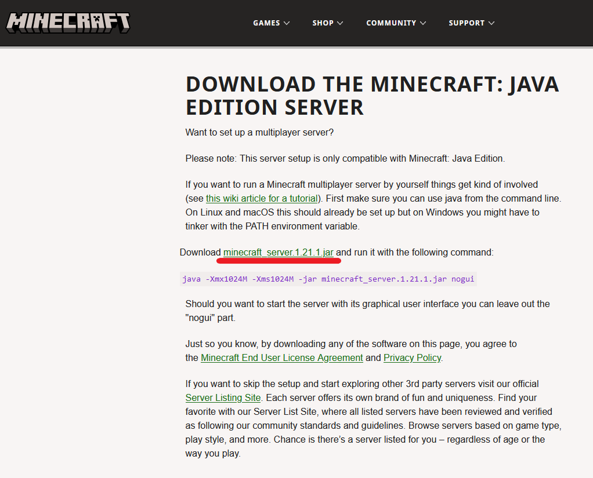
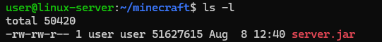
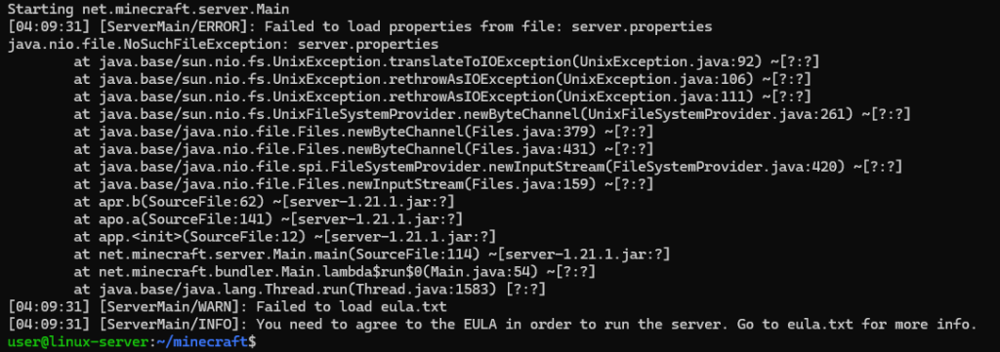
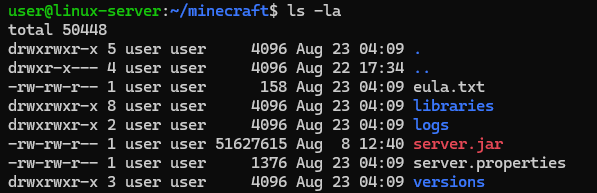
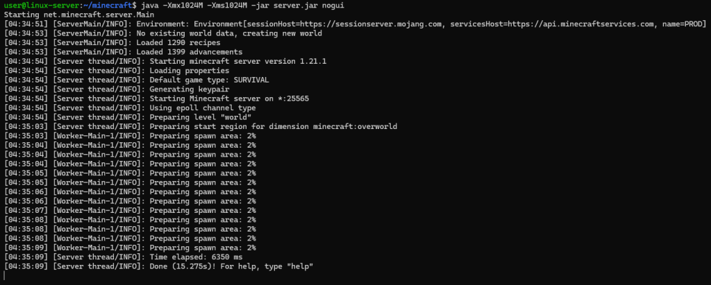

# How to install Minecraft server on Ubuntu 24.04
Minecraft is a sandbox video game developed and published by Mojang Studios. It was created by Markus “Notch” Persson and released as a public alpha for PC in 2009 before its official release in November 2011. The game has since become one of the best-selling video games of all time, with over 200 million copies sold across all platforms.
## How to install Minecraft server on Ubuntu 24.04
Before starting the installation you need to update the package lists using the command:
```
sudo apt update
```
Minecraft requires Java to run. Ubuntu 24.04 should have OpenJDK available. To install it run the command:
```
sudo apt install openjdk-21-jdk
```
Next, navigate to the home directory:
```
cd ~
```
Then create the directory for the future Minecraft server. For example, name it `minecraft`:
```
mkdir minecraft
```
And navigate the created directory:
```
cd minecraft
```
Next, get the download link for the latest version from the [download page](https://www.minecraft.net/en-us/download/server).



To download the archive containing Minecraft distribution run the command `wget` using the copied link:
```
wget https://piston-data.mojang.com/v1/objects/59353fb40c36d304f2035d51e7d6e6baa98dc05c/server.jar
```
As a result, you will find `server.jar` file in the current directory. To verify this run the command `ls -l`:



This completes the installation. So let’s move on to the first Minecraft server launch.
## First Minecraft Server Launch
`server.jar` is an executable file in Java format that contains all the necessary components to run the Minecraft server.

With the following command, make the first start of your Minecraft server from the directory `~/minecraft`:
```
java -Xmx1024M -Xms1024M -jar server.jar nogui
```
It is highly likely that the first launch will fail:



This error means that the Minecraft server has not found files in the current directory `eula.txt` and `server.properties`. The first of the files is the license agreement file, the second is the configuration file. At the time of the launch of the Minecraft server, they really were not there. But at the same time, they were created during the first launch. To make sure they are available, check the contents of the current directory using the command:
```
ls -la
```
We can see that this is actually the case:



Now edit `eula.txt` using the nano text editor:
```
nano eula.txt
```
The contents of the file look like this:
```
#By changing the setting below to TRUE you are indicating your agreement to our EULA (https://aka.ms/MinecraftEULA).
#Fri Aug 23 04:09:31 UTC 2024
eula=false
```
In particular, the file contains a link to the Minecraft user agreement. If you agree with its provisions, replace the line `eula=false` with `eula=true` in the text of the file. Then close the file and save the changes you have made using the keyboard shortcut `Ctrl X`, then press `Y` and Enter.

After that, launch the server again with the command:
```
java -Xmx1024M -Xms1024M -jar server.jar nogui
```



Now your server is running. To stop the Minecraft server, use the command:
```
stop
```
You also need to edit the `server.properties` file. In it, we are interested in the `online-mode` parameter, which is responsible for whether or not our Minecraft server will authenticate player accounts using official Mojang servers. In order for our server to allow access to players without such verification, the `online-mode` parameter must be set to `false`. To make changes to this configuration file, open it using the nano text editor:
```
nano server.properties
```
Find the line with the `online-mode` parameter and make it look like:
```
online-mode=false
```
Then close the `server.properties` file and save the changes you have made.

Next, launch the Minecraft server again:
```
java -Xmx1024M -Xms1024M -jar server.jar nogui
```
## Connecting to the Game

After launching the server you can already connect to the virtual Minecraft world from a local computer. To do this, you need to use the launcher software that is used to launch the game. The launcher downloads the necessary files and resources, checks the integrity of the game, updates the client if there are updates available, and then launches the game itself. To install the launcher download the appropriate installer and run it to install the necessary software on your computer.

Once the launcher have been installed, launch it. Then, at the bottom of its interface, specify the name of your player, the version of the game and click Install:

