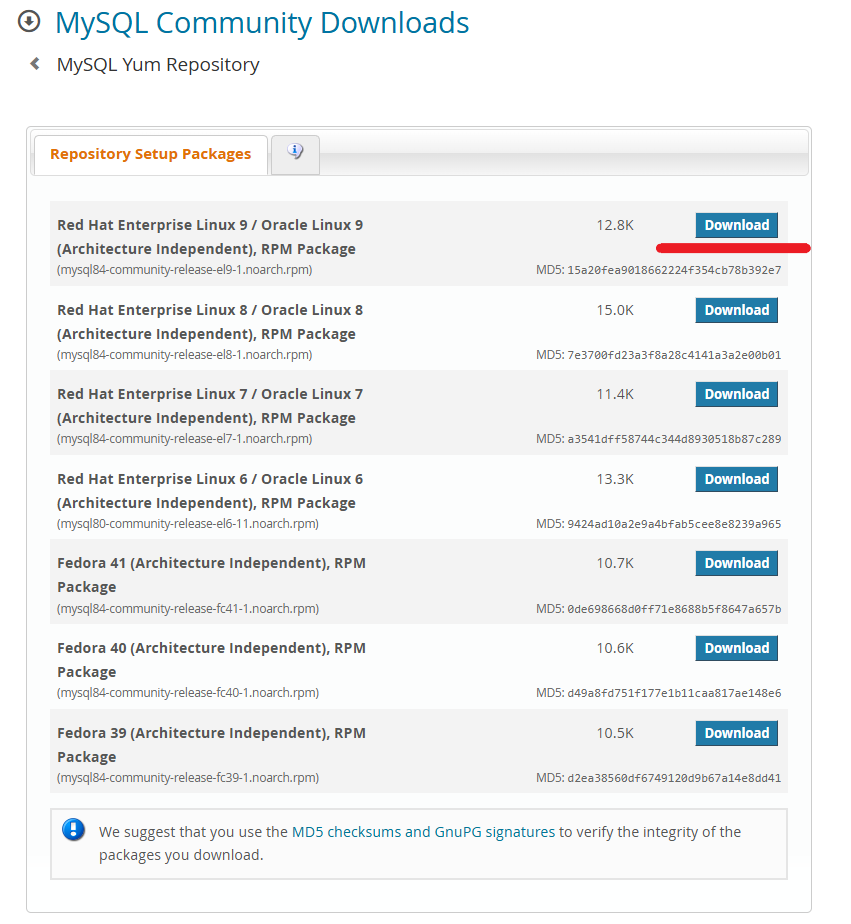
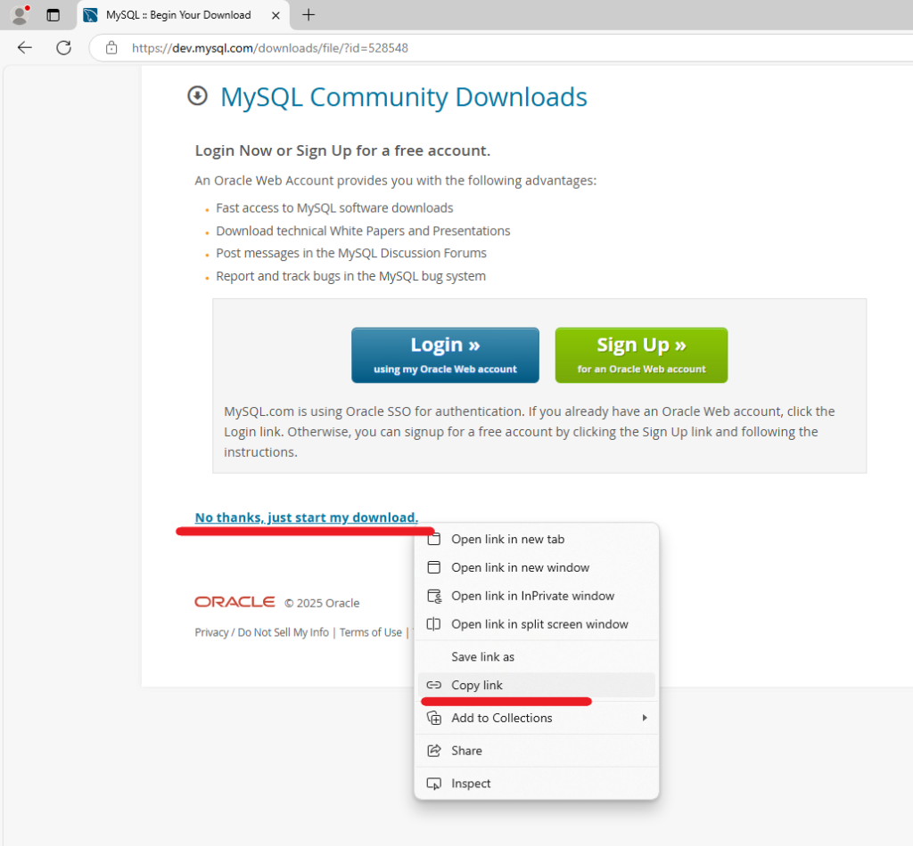
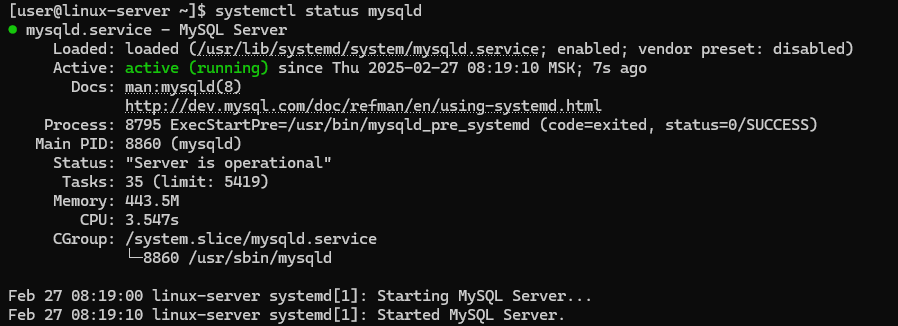
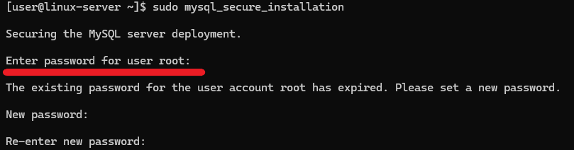
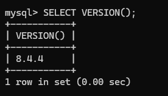

# How to Install MySQL on CentOS Stream 9

MySQL is an open-source relational database management system used to store and manage structured data. It is widely used in web applications, including CMS platforms like WordPress and e-commerce sites. MySQL supports SQL for querying and managing data efficiently. It is known for its reliability, scalability, and compatibility with various operating systems, making it a popular choice for developers and enterprises.

The installation can be done using the MySQL Community Repository or using the CentOS AppStream Repository. The MySQL Community Repository method provides the latest MySQL version with frequent updates and security patches directly from MySQL, while the CentOS AppStream Repository offers an older but more stable version maintained by CentOS. The first method requires manually enabling the MySQL repository but gives more flexibility in choosing versions, whereas the second method is simpler since it uses CentOS’s default repositories.

Next, let’s look at how to install the latest MySQL version on CentOS Stream 9 using the MySQL Community Repository.

## How to Install MySQL on CentOS Stream 9

In the case of installation using the MySQL Community Repository, you must download the required version .rpm file. An .rpm file (Red Hat Package Manager file) is a package format used by RHEL-based Linux distributions, including CentOS, to install, update, and manage software.

To download the .rpm file, navigate to [MySQL Yum Repository page](https://dev.mysql.com/downloads/repo/yum/) and click `Download` in the Red Hat Enterprise Linux 9 RPM Package section.



Log in or sign up on the next page or click the right mouse button on the `No thanks, just start my download` line and select `Copy link` from the context menu.



Then, download and install the RPM package, which adds the MySQL repository to the system, using the default package manager and the previously copied link:
```
sudo dnf install https://dev.mysql.com/get/mysql84-community-release-el9-1.noarch.rpm
```
In the next step, install the MySQL Server package:
```
sudo dnf install mysql-community-server
```
After the installation is completed, configure the `mysqld` service to start automatically on boot and start the service immediately:
```
sudo systemctl enable --now mysqld
```
To check the service status, use the command:
```
systemctl status mysqld
```
The output of the command should not contain any error messages.



## How to Secure MySQL Installation

To connect to the MySQL command line, you must have a username and password. The username is `root`. To find out the password, search for lines containing the word `password` in the MySQL log file, which is useful for retrieving the temporary `root` password generated during MySQL’s first installation:
```
sudo grep 'password' /var/log/mysqld.log
```
For example, in the screenshot below, the red arrow indicates the temporary `root` password:


To protect the databases from attacks and unauthorized access as much as possible, run the built-in security script after installing MySQL. The mysql_secure_installation script is a security tool that helps improve database security by applying essential configurations. It allows you to set a strong root password, remove anonymous users, disable remote root login, and delete the test database. Running this script is highly recommended after installing MySQL to harden security and reduce vulnerabilities. To execute it, simply run:
```
sudo mysql_secure_installation
```
When running, the script will ask you to specify a password for the user `root`, which is the temporary `root` password from the screenshot above.



If you use a temporary password, the script will ask you to enter a new `root` password. The script will then ask for your consent to:

remove anonymous users;

disallow `root` login remotely;

remove test database and access to it;

reload privilege tables.

To confirm your consent, press the `Y` key.

After that, you will be able to connect to the command line interface using the password set during the execution of the security script:
```
mysql -u root -p
```
Once connected, check, for example, the version to make sure that the MySQL installation is correct:
```
SELECT VERSION();
```
The screenshot below shows that the MySQL version is 8.4.4.


