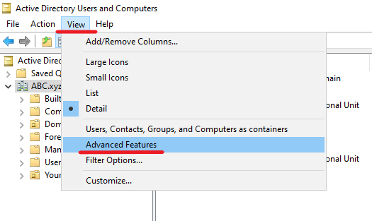
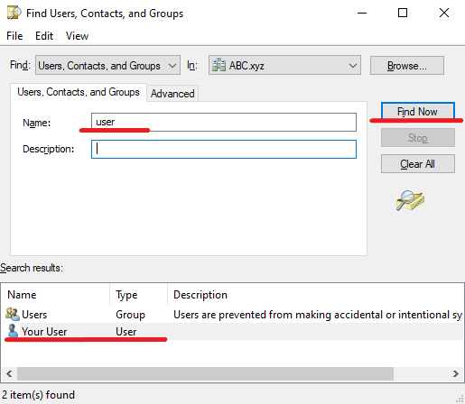
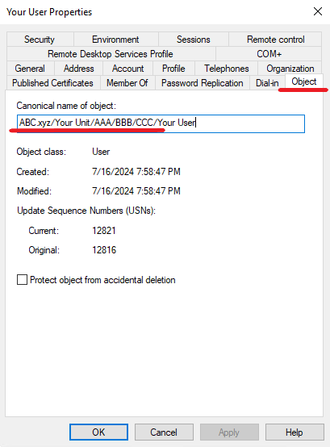

# How to search for a user's location within Active Directory Using Active Directory Users and Computers and PowerShell
To search for a user’s location within Active Directory, you can use tools like Active Directory Users and Computers (ADUC) or PowerShell.
## Using Active Directory Users and Computers (ADUC)
First, open ADUC. To do this, go to Start ➝ Administrative Tools ➝ Active Directory Users and Computers. Then navigate to the View menu and select Advanced Features.

After that use the search function to find the user – make a right-click on the domain or the appropriate container, select Find, enter the username in the search field and click Find Now.

In the search results, right-click the user and select Properties. With Advanced Features enabled, the Object tab should now be visible, showing the canonical name of object, which includes the user’s location within the directory.

## Using PowerShell

You can use PowerShell to find the OU of a user. Here is a command that will help you find out:

Get-ADUser -Identity username -Properties CanonicalName | Select-Object CanonicalName

Replace your-user with the actual username.

The output of the command will look something like this:
