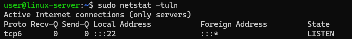
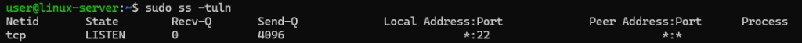
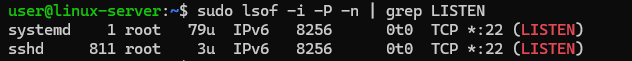

# How to search opened ports in Linux
Opening ports on a system is necessary for various reasons, primarily related to enabling communication between different devices and services over a network. For example, ports 80 (HTTP) and 443 (HTTPS) need to be open for web servers like Apache or Nginx to accept incoming requests, ports like 25 (SMTP), 110 (POP3), and 143 (IMAP) need to be open for email servers to send and receive emails, ports 20 and 21 need to be open for FTP servers to transfer files etc.

Opening ports facilitates communication and functionality of services but must be done with careful consideration of security risks and requirements. While opening ports is necessary for various services to function, it’s also important to be aware of the security implications.

There are several ways to detect open ports on Linux.

## Using netstat
netstat is a command-line tool that provides information about network connections, routing tables, interface statistics, masquerade connections, and multicast memberships. First install netstat (if not already installed):
```
sudo apt-get install net-tools
```
Check open ports:
```
sudo netstat -tuln
```
In this case, the following options are used:

- -t: show TCP ports;
- -u: show UDP ports;
- -l: show only listening ports;
- -n: show numerical addresses instead of resolving hosts.



## Using ss

ss is a utility to investigate sockets. It’s faster and more informative than netstat. Check open ports:
```
sudo ss -tuln
```
The utility uses the following keys:

- -t: show TCP ports;
- -u: show UDP ports;
- -l: show only listening ports;
- -n: show numerical addresses.



## Using lsof

lsof (list open files) can also be used to check open ports. Install lsof (if not already installed):
```
sudo apt-get install lsof
```
Check open ports:
```
sudo lsof -i -P -n | grep LISTEN
```
lsof uses the following options:

- -i: selects the listing of files any of whose Internet address matches the address specified;
- -P: inhibits the conversion of port numbers to port names for network files;
- -n: Inhibits the conversion of network numbers to host names.



## Using nmap

nmap is a network scanning tool that can also be used to check open ports. Install nmap (if not already installed):
```
sudo apt-get install nmap
```
Then scan for open ports:
```
sudo nmap -sT -O localhost
```
The following options are used here:

- -sT: TCP connect scan;
- -O: Enable OS detection.


