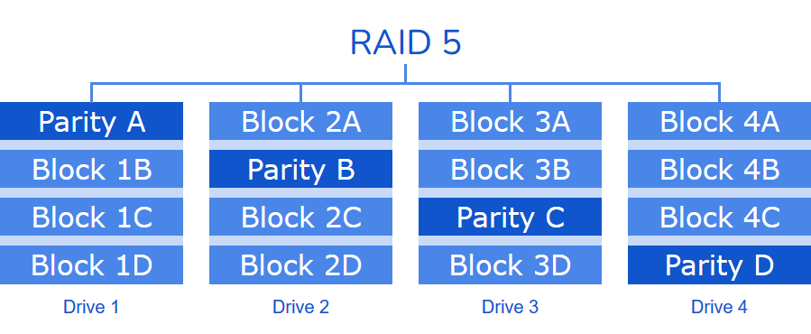
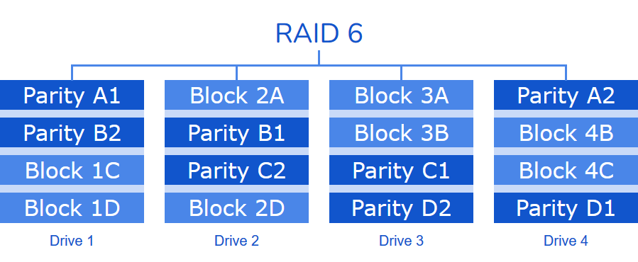
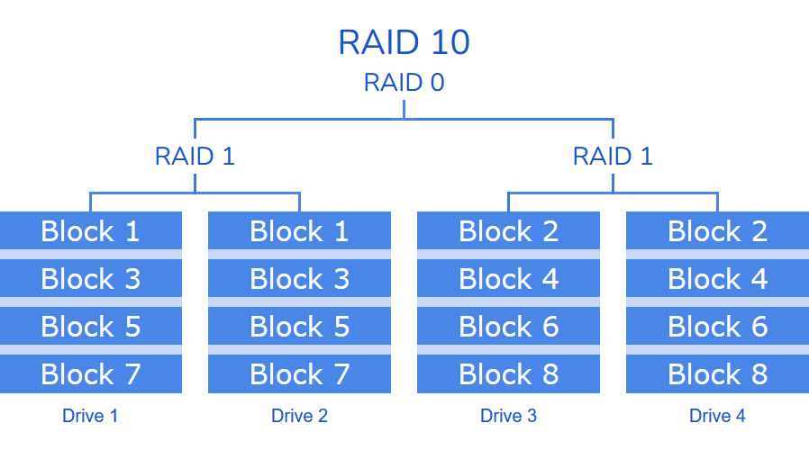
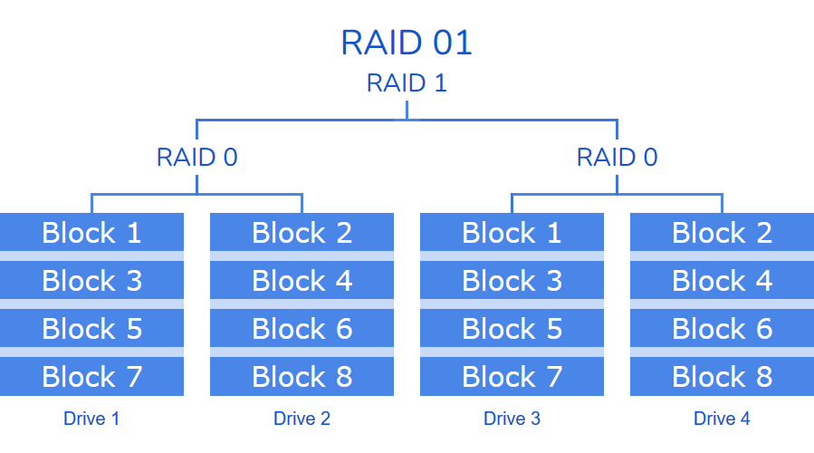
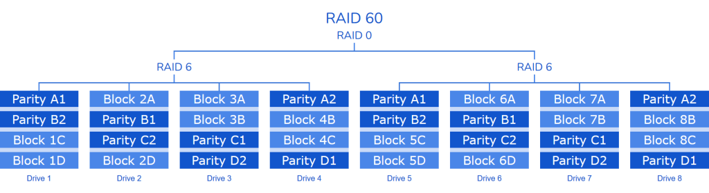

# RAID Levels
RAID (Redundant Array of Independent Disks) is a technology used to combine multiple physical disk drives into a single logical unit for the purposes of data redundancy, performance improvement, or both.
There are several types of RAID configurations.
## RAID 0 (Striping)
**Description:** Data is split across multiple disks.

**Advantages:** Improved performance due to parallelism.

**Disadvantages:** No redundancy; if one disk fails, all data is lost.

**Use Case:** High-performance applications where data loss is not critical.

## RAID 1 (Mirroring)
**Description:** Data is duplicated on two or more disks.

**Advantages:** High redundancy; if one disk fails, data is still available.

**Disadvantages:** Storage capacity is halved; higher cost.

**Use Case:** Critical data storage where reliability is important.

## RAID 5 (Striping with Parity)
**Description:** Data and parity information are striped across three or more disks.

**Advantages:** Good balance of performance, redundancy, and storage efficiency.

**Disadvantages:** Write performance can be slower due to parity calculations; requires at least three disks.

**Use Case:** File and application servers where read speed and redundancy are important.

## RAID 6 (Striping with Double Parity)
**Description:** Similar to RAID 5 but with an additional parity block.

**Advantages:** Can withstand two disk failures; higher redundancy.

**Disadvantages:** Requires at least four disks; more complex and slower write performance.

**Use Case:** Environments with large data sets and higher fault tolerance requirements.

## RAID 10 (1+0)
**Description:** Combines RAID 1 and RAID 0; data is mirrored and then striped.

**Advantages:** High performance and redundancy.

**Disadvantages:** Requires at least four disks; storage capacity is halved.

**Use Case:** High-performance databases and applications requiring both speed and redundancy.

## RAID 01 (0+1)
**Description:** Combines RAID 0 and RAID 1; data is striped and then mirrored.

**Advantages:** High performance and redundancy.

**Disadvantages:** Requires at least four disks; less efficient than RAID 10.

**Use Case:** Similar to RAID 10, but less common due to less optimal redundancy.

## RAID 50 (5+0)
**Description:** Combines RAID 5 and RAID 0; data is striped across RAID 5 arrays.

**Advantages:** Improved performance and redundancy compared to RAID 5.

**Disadvantages:** Requires at least six disks; more complex setup.

**Use Case:** Large-scale storage systems where both speed and redundancy are important.

## RAID 60 (6+0)
**Description:** Combines RAID 6 and RAID 0; data is striped across RAID 6 arrays.

**Advantages:** Can withstand multiple disk failures; high performance and redundancy.

**Disadvantages:** Requires at least eight disks; more complex setup.

**Use Case:** Enterprise environments with critical data requiring high fault tolerance and performance.

## Non-Standard RAID Levels
There are several non-standard RAID types. Non-standard RAID levels like RAID 2, RAID 3 and RAID 4 are not commonly used today.

## RAID 2
**Description:** Bit-level striping with Hamming code for error correction.

**Use Case:** Rarely used due to complexity and better alternatives available.

## RAID 3

**Description:** Byte-level striping with dedicated parity disk.

**Use Case:** Rarely used; replaced by RAID 5.

## RAID 4

**Description:** Block-level striping with dedicated parity disk.

**Use Case:** Less common; replaced by RAID 5 for better performance.
